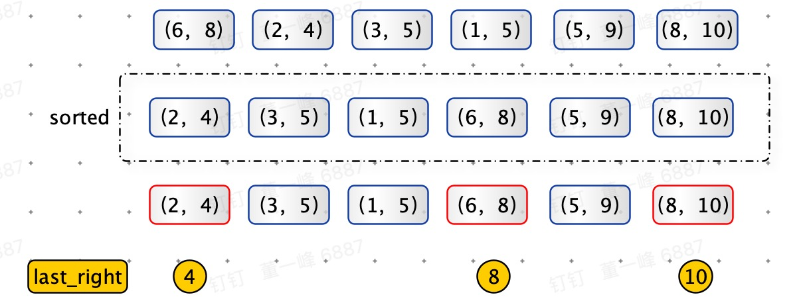

# 区间覆盖（Merge Intervals）

> 区间覆盖：有 n 个闭区间，从这 n 个区间中选出部分区间，这些区间满足两两不想交，最多能选出多少区间。

**示例 1：**

```python
区间：[6,8] [2,4] [3,5] [1,5] [5,9] [8,10]
不相交区间：[2,4] [6,8] [8,10]
```

**思路：**

根据右端点升序，优先选出右端点小的区间。右端点小，表明最早结束，并且为后续选择留下的空间最大。

<font color=red>注意：任务调度，教室排课都是区间覆盖问题的变种</font>



**代码：**

```python
def merge_intervals(intervals):
    res = []
    last_right = 0
    for left, right in sorted(intervals, key=lambda item: item[1]):
        if left < last_right: continue
        res.append([(left, right)])
        last_right = right
    return res

print(merge_intervals([(6, 8), (2, 4), (3, 5), (1, 5), (5, 9), (8, 10)]))
```

