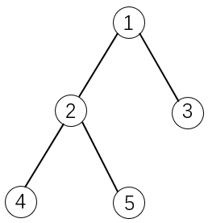

[TOC]


背包问题（Knapsack problem）是一种组合优化的NP完全（NP-Complete，NPC）问题。问题可以描述为：给定一组物品，每种物品都有自己的重量和价格，在限定的总重量内，我们如何选择，才能使得物品的总价格最高。NPC问题是没有多项式时间复杂度的解法的，但是利用动态规划，我们可以以伪多项式时间复杂度求解背包问题。


# 01 背包问题

<font color=red>每个物品最多只能放一次</font>

**题目：**

> 有 N 件物品和一个容量为 V 的背包。第 i 件物品的体积是 c[i]，价值是 w[i]。求解将哪些物品装入背包可使价值总和最大。


**思路：动态规划**

子问题：dp\[i][v] 当前第 i 物品，容量为 v 时背包的最大价值。

状态转移方程：dp\[i][v] = max( dp\[ i - 1][v], dp\[ i - 1][ v-c[i]]+ w[i] )

- 将 i 件物品不放入背包：dp\[i - 1][v]
- 将 i 件物品放入背包：dp\[ i - 1][ v-c[i] ] + w\[ i ]


```python
def knapsack01(c, w, v):
    n = len(c)
    dp = [[0] * (v + 1) for _ in range(n + 1)]

    for i in range(1, n + 1):
        for j in range(0, v + 1):
            if j >= c[i - 1]:
                dp[i][j] = max(dp[i - 1][j], dp[i - 1][j - c[i - 1]] + w[i - 1])
            else:
              	# 如果背包载重小于商品总重量，则该商品无法放入背包，收益不变
                dp[i][j] = dp[i - 1][j]  

    return dp[-1][-1]

print(knapsack01([1, 2, 5, 6, 7], [1, 6, 18, 22, 28], 11))
```


**思路：动态规划--滚动数组**

```python
def knapsack01_v2(c, w, v):
    n = len(c)
    dp = [0] * (v + 1)

    for i in range(1, n + 1):
        for j in range(0, v + 1):
            if j >= c[i - 1]:
                dp[j] = max(dp[j], dp[j - c[i - 1]] + w[i - 1])
                
    return dp[-1]
```

**小结**

​		0-1 背包问题是最基础背包问题，它包含了背包问题中长状态设计，转移方程的最基本思想。其他的背包问题往往可以转换成 0 - 1 背包问题来求解。


# 完全背包问题

<font color="red">每种物品可以放无限多次</font>

**题目：**

> 有 N 种物品和一个容量为 V 的背包，每种物品都有无限件可用。第 i 种物品的体积是 c[i]，价值是 w[i]。求解将哪些物品装入背包可使这些物品的总体积和不超过背包容量，且价值总和最大。


**思路：动态规划**

0-1 背包问题每个商品只有两种状态：选择，不选择。或者：选择个数为：0，1

完全背包问题：每种物品都有无限件可用。所以每个商品的状态为，选择（0,1,...,k）次。

状态转移方程：$dp[i][v] = max( dp[i - 1][ v-k*c[i]] + k*w[i] );k\in[0,\frac{v}{c[i]}]$​​​​    $v>=k*c[i]$​

```python
def knapsack_complete(c, w, v):
    n = len(c)
    dp = [[0] * (v + 1) for _ in range(n + 1)]

    for i in range(1, n + 1):
        for j in range(0, v + 1):
            dp[i][j] = dp[i - 1][j]
            if j >= c[i - 1]:
                # 第 i 个物品放 k 次。
                k = 1
                while j - k * c[i - 1] >= 0:
                    dp[i][j] = max(dp[i][j], dp[i - 1][j - k * c[i - 1]] + k * w[i - 1])
                    k += 1

    return dp[-1][-1]
  
c = [5, 7]
w = [5, 8]
v = 10
print(knapsack_complete2(c, w, v))
```


**思路：动态规划--滚动数组**

```python
def knapsack_complete2(c, w, v):
    n = len(c)
    dp = [0] * (v + 1)

    for i in range(1, n + 1):
        for j in range(0, v + 1):
            if j >= c[i - 1]:
                k = 1
                while j - k * c[i - 1] >= 0:
                    dp[j] = max(dp[j], dp[j - k * c[i - 1]] + k * w[i - 1])
                    k += 1

    return dp[-1]
```


**思路：转化为 0-1 背包问题**

虽然每种物品都有无限件可用，但是由于受限于背包的容量，物品是有使用次数的最大上限的：$\frac{V}{c[i]}$​。因此可以将每个商品复制 $\frac{V}{c[i]}$​​ 个，这样就转化为 0-1 背包问题。


```python
def knapsack_complete3(c, w, v):
    for i in range(len(c)):
        num = int(v / c[i]) - 1
        c += [c[i]] * num
        w += [w[i]] * num

    return knapsack01(c, w, v)

def knapsack01(c, w, v):
    n = len(c)
    dp = [0] * (v + 1)

    for i in range(1, n + 1):
        for j in range(0, v + 1):
            if j >= c[i - 1]:
                dp[j] = max(dp[j], dp[j - c[i - 1]] + w[i - 1])

    return dp[-1]
```


# 多重背包问题

<font color="red">每种物品有一个固定的次数上限</font>

> 有 N 种物品和一个容量为 V 的背包。第 i 种物品最多有 n[i] 件可用，每件费用是 c[i] ，价值是 w[i] 。求解将哪些物品装入背包可使这些物品的费用总和不超过背包容量，且价值总和最大。

**思路：动态规划**

与完全背包一致。

```python
def multiple_choice_knapsack2(c, w, n, v):
    l = len(c)
    dp = [[] * (v + 1) for _ in range(l + 1)]
    for i in range(1, l + 1):
        for j in range(0, v + 1):
            dp[i][j] = dp[i - 1][j]
            if j >= c[i - 1]:
                k = 1
                while j - k * c[i - 1] >= 0 and k <= n[i]:
                    dp[i][j] = max(dp[i][j], dp[i - 1][j - k * c[i - 1]] + k * w[i - 1])
    return dp[-1][-1]
```

**思路：动态规划--滚动数组**

```python
def multiple_choice_knapsack3(c, w, n, v):
    l = len(c)
    dp = [] * (v + 1) 
    for i in range(1, l + 1):
        for j in range(0, v + 1):
            dp[j] = dp[j]
            if j >= c[i - 1]:
                k = 1
                while j - k * c[i - 1] >= 0 and k <= n[i]:
                    dp[j] = max(dp[j], dp[j - k * c[i - 1]] + k * w[i - 1])
    return dp[-1]
```


**思路：转化为 0-1 背包问题**

第 i 种物品复制出 n[i] 件。

```python
def multiple_choice_knapsack(c, w, n, v):
    for i in n:
        c += [c[i]] * i
        w += [w[i]] * i

    return knapsack01(c, w, v)

def knapsack01(c, w, v):
    n = len(c)
    dp = [0] * (v + 1)

    for i in range(1, n + 1):
        for j in range(0, v + 1):
            if j >= c[i - 1]:
                dp[j] = max(dp[j], dp[j - c[i - 1]] + w[i - 1])

    return dp[-1]
```

# 混合三种背包问题

<font color="red">将前面三种简单问题叠加成较复杂的问题</font>

# 二维费用的背包问题

<font color="red">一个简单的常见扩展</font>

> 二维费用是指除了物品的重量之外 c1[i]，还需要考虑另一种可消耗因素 c2[i]（比如体积），即需总重量不超过 v1 且总体积不可超过v2 ，这时我们的费用增加了一维，那状态转移方程也要相应的增加一维:

$f[i][v][u]=max{f[i-1][v][u],f[i-1][v-a[i]][u-b[i]]+w[i]}$

```python
def knapsack(c1, c2, w, v1, v2):
    n = len(w)
    dp = [[[0] * (v1 + 1) for _ in range(v2 + 1)] for _ in range(n + 1)]
    for i in range(n + 1):
        for j in range(v2 + 1):
            for k in range(v1 + 1):
                dp[i][j][k] = max(dp[i - 1][j][k], dp[i - 1][j - c2[i]][k - c1[i]] + w[i])

    return dp[-1][-1][-1]
```


# 分组的背包问题

<font color="red">一种题目类型，也是一个有用的模型。后两节的基础</font>

> 有 N 件物品和一个容量为 v 的背包。第 i 件物品的费用是 c[i]，价值是 w[i]。这些物品被划分为若干组，每组中的物品互相冲突，最多选一件。求解将哪些物品装入背包可使这些物品的费用总和不超过背包容量，且价值总和最大。

**思路：动态规划**

dp\[i][j] 是前 i 组物品，能放入容量为 j 的背包的最大价值。

状态转移方程：$dp[i][j] = max(dp[i-1][j],dp[i-1][j-v_1]+w_1,dp[i-1][j-v_2]+w_2,...,dp[i-1][j-v_s]+w_s)$

第 i 组有 s 个物品。


```python
def knapsack(group, v):
    n = len(group)
    dp = [[0] * (v + 1) for _ in range(1 + n)]
    for i in range(1, n + 1):
        for j in range(v + 1):
            dp[i][j] = dp[i][j - 1]
            for c, k in group[i - 1]:
                if j >= c:
                    dp[i][j] = max(dp[i][j], dp[i - 1][j - c] + k)
    return dp[-1][-1]

group = [[(1, 2), (2, 3)], [(1, 1), (3, 5), (2, 4)]]
print(knapsack(group, 8))
```


# 有依赖的背包问题

<font color="red">另一种给物品的选取加上限制的方法</font>

> 这种背包问题的物品间存在某种“依赖”的关系。也就是说，i 依赖于 j，表示若选物品 i，则必须选物品 j。



如果选择物品 5，则必须选择物品 1 和 2。这是因为 2 是 5 的父节点，1 是 2 的父节点。依赖是单向的。


**思路：动态规划-转化为 01 背包问题**

修改节点容量和价值（加上父节点的容量和价值），去掉依赖关系。

```python
def knapsack(W, V):
    # 去掉依赖
    for i in range(len(W)):
        v, w, p = W[i]
        if p == -1: continue
        p_p = p
        new_v = v
        new_w = w
        while p_p != -1:
            p_v, p_w, p_p = W[p_p]
            new_v += p_v
            new_w += p_w
        W[i] = [new_v, new_w, -1]

    return knapsack01(W, V)


def knapsack01(W, v):
    n = len(W)
    dp = [0] * (v + 1)

    for i in range(1, n + 1):
        for j in range(0, v + 1):
            if j >= W[i - 1][0]:
                dp[j] = max(dp[j], dp[j - W[i - 1][0]] + W[i - 1][1])

    return dp[-1]


W = [[2, 3, -1],
     [2, 2, 0],
     [3, 5, 0],
     [4, 7, 1],
     [3, 6, 1]]
V = 7
print(knapsack(W, V))
```


# 泛化物品


# 背包问题问法的变化