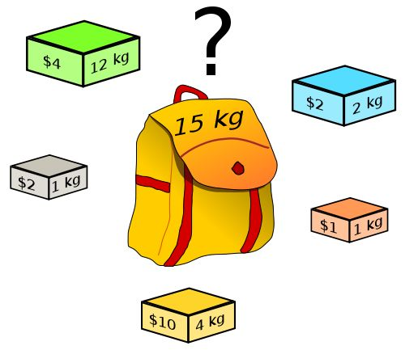

[TOC]



背包问题（Knapsack problem）是一种组合优化的NP完全（NP-Complete，NPC）问题。问题可以描述为：给定一组物品，每种物品都有自己的重量和价格，在限定的总重量内，我们如何选择，才能使得物品的总价格最高。NPC问题是没有多项式时间复杂度的解法的，但是利用动态规划，我们可以以伪多项式时间复杂度求解背包问题。


# 01 背包问题

<font color=red>每个物品最多只能放一次</font>

**题目：**

> 有 N 件物品和一个容量为 V 的背包。第 i 件物品的体积是 c[i]，价值是 w[i]。求解将哪些物品装入背包可使价值总和最大。


**思路：动态规划**

子问题：dp\[i][v] 当前第 i 物品，容量为 v 时背包的最大价值。

状态转移方程：dp\[i][v] = max( dp\[ i - 1][v], dp\[ i - 1][ v-c[i]]+ w[i] )

- 将 i 件物品不放入背包：dp\[i - 1][v]
- 将 i 件物品放入背包：dp\[ i - 1][ v-c[i] ] + w\[ i ]


```python
def knapsack01(c, w, v):
    n = len(c)
    dp = [[0] * (v + 1) for _ in range(n + 1)]

    for i in range(1, n + 1):
        for j in range(0, v + 1):
            if j >= c[i - 1]:
                dp[i][j] = max(dp[i - 1][j], dp[i - 1][j - c[i - 1]] + w[i - 1])
            else:
              	# 如果背包载重小于商品总重量，则该商品无法放入背包，收益不变
                dp[i][j] = dp[i - 1][j]  

    return dp[-1][-1]

print(knapsack01([1, 2, 5, 6, 7], [1, 6, 18, 22, 28], 11))
```


**思路：动态规划--滚动数组**

```python
def knapsack01_v2(c, w, v):
    n = len(c)
    dp = [0] * (v + 1)

    for i in range(1, n + 1):
        for j in range(0, v + 1):
            if j >= c[i - 1]:
                dp[j] = max(dp[j], dp[j - c[i - 1]] + w[i - 1])
                
    return dp[-1]
```

**小结**

​		0-1 背包问题是最基础背包问题，它包含了背包问题中长状态设计，转移方程的最基本思想。其他的背包问题往往可以转换成 0 - 1 背包问题来求解。


# 完全背包问题

**题目：**

> 有 N 种物品和一个容量为 V 的背包，每种物品都有无限件可用。第 i 种物品的体积是 c[i]，价值是 w[i]。求解将哪些物品装入背包可使这些物品的总体积和不超过背包容量，且价值总和最大。


**思路：动态规划**

0-1 背包问题每个商品只有两种状态：选择，不选择。或者：选择个数为：0，1

完全背包问题：每种物品都有无限件可用。所以每个商品的状态为，选择（0,1,...,k）次。

状态转移方程：$dp[i][v] = max( dp[i - 1][ v-k*c[i]] + k*w[i] );k\in[0,\frac{v}{c[i]}]$​​​​    $v>=k*c[i]$​

```python
def knapsack_complete(c, w, v):
    n = len(c)
    dp = [[0] * (v + 1) for _ in range(n + 1)]

    for i in range(1, n + 1):
        for j in range(0, v + 1):
            dp[i][j] = dp[i - 1][j]
            if j >= c[i - 1]:
                # 第 i 个物品放 k 次。
                k = 1
                while j - k * c[i - 1] >= 0:
                    dp[i][j] = max(dp[i][j], dp[i - 1][j - k * c[i - 1]] + k * w[i - 1])
                    k += 1

    return dp[-1][-1]
  
c = [5, 7]
w = [5, 8]
v = 10
print(knapsack_complete2(c, w, v))
```


**思路：动态规划--滚动数组**

```python
def knapsack_complete2(c, w, v):
    n = len(c)
    dp = [0] * (v + 1)

    for i in range(1, n + 1):
        for j in range(0, v + 1):
            if j >= c[i - 1]:
                k = 1
                while j - k * c[i - 1] >= 0:
                    dp[j] = max(dp[j], dp[j - k * c[i - 1]] + k * w[i - 1])
                    k += 1

    return dp[-1]
```


**思路：转化为 0-1 背包问题**

虽然每种物品都有无限件可用，但是由于受限于背包的容量，物品是有使用次数的最大上限的：$\frac{V}{c[i]}$​。因此可以将每个商品复制 $\frac{V}{c[i]}$​​ 个，这样就转化为 0-1 背包问题。


```python
def knapsack_complete3(c, w, v):
    for i in range(len(c)):
        num = int(v / c[i]) - 1
        c += [c[i]] * num
        w += [w[i]] * num

    return knapsack01(c, w, v)

def knapsack01(c, w, v):
    n = len(c)
    dp = [0] * (v + 1)

    for i in range(1, n + 1):
        for j in range(0, v + 1):
            if j >= c[i - 1]:
                dp[j] = max(dp[j], dp[j - c[i - 1]] + w[i - 1])

    return dp[-1]
```


# 多重背包问题


# 混合三种背包问题


# 二维费用的背包问题


# 分组的背包问题


# 有依赖的背包问题


# 泛化物品


# 背包问题问法的变化