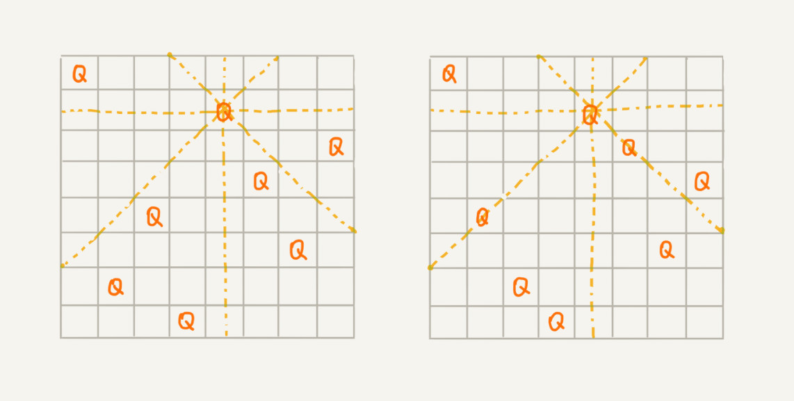

[TOC]

- 贪心算法：一条路走到黑，就一次机会，只能哪边看着顺眼就走哪边。
- 回溯算法：一条路走到黑，无数次重来的机会，还怕我走不出来

回溯算法应用非常广泛：

1. 指导深度优先搜索。
2. 正则表达式的匹配。
3. 编译原理中的语法分析。
4. 数独
5. 八皇后
6. 0-1 背包
7. 图的着色
8. 旅行商问题
9. 全排列
10. ...

# 回溯算法

​		回溯的处理思想，有点类似枚举搜索。我们枚举所有的解，找到满足期望的解。为了有规律地枚举所有可能的解，避免遗漏和重复，我们把**==问题求解的过程分为多个阶段==**。每个阶段，我们都会面对一个岔路口，我们先随意选一条路走，当发现这条路走不通的时候（不符合期望的解），就回退到上一个岔路口，另选一种走法继续走。

# 八皇后

问题：8 x 8 的棋盘，希望往里放 8 个棋子（皇后），每个棋子所在的行、列、对角线都不能有另一个棋子。你可以看我画的图，第一幅图是满足条件的一种方法，第二幅图是不满足条件的。八皇后问题就是期望找到所有满足这种要求的放棋子方式。



分析：

```python
n = 8
# 下标表示行，值表示 queen 存储在哪一列
res = [None] * n

def cal8queens(row):
    # 8 个棋子都放置好了，打印结果
    if row == n:
        print(res)
        print_queens(res)
        return
    # 每一行都有 8 中方法
    for column in range(n):
        # 有些方法不满足要求
        if is_ok(row, column):
            # 第 row 行的棋子放到了 column 列
            res[row] = column
            # 考察下一行
            cal8queens(row + 1)

# 判断 row 行 column 列放置是否合适
def is_ok(row, column):
    left_up = column - 1
    right_up = column + 1
    # 逐行往上考擦每一行
    for i in range(row - 1, -1, -1):
        # 第 i 行 的 column 有棋子吗？
        if res[i] == column: return False
        # 考擦左上对角线：第 i 行 left_up 列有棋子吗？
        if left_up >= 0:
            if res[i] == left_up: return False
        # 考擦右上对角线：第 i 行 right_p 列有棋子吗？
        if right_up < n:
            if res[i] == right_up: return False
        left_up -= 1
        right_up += 1
    return True

def print_queens(res):
    for row in range(n):
        for column in range(n):
            if res[row] == column:
                print("Q", end=" ")
            else:
                print("*", end=" ")
        print()
    print()

cal8queens(0)
```

# 0 - 1 背包

问题：一个背包，总承重是：w kg，有 n 个不可分割的物品。求在不超过背包所能装载的重量下，让背包中物品的总重量最大？


分析：每个物品有两个状态：放，不放。整个问题就分解为了 n 个阶段，每个阶段对应一个物品怎么选择。先对第一个物品进行处理，选择装进去或者不装进去，然后再递归地处理剩下的物品。

f ( i ) =  f( i-1 ) or f(i-1) +w[i] 

```python
'''
i:表示考察到哪个物品了
cw: 表示当前已经装进去的物品重量和
items: 表示每个物品的重量
n: 物品的个数
w：背包重量
'''

# 存储背包中物品重量的最大值
max_w = -2147483648
items = [2, 2, 4, 6, 3]
n = len(items)
w = 9

def f(i, cw):
    global max_w
    # cw == w 表示装满了
    # i == n 表示已经考察完毕所有的物品
    if cw == w or i == n:
        if cw > max_w: max_w = cw
        return
    # 选择不装第 i 个物品
    f(i + 1, cw)
    # 已经超过背包可以承受的重量时，就不要在添加了
    if cw + items[i] <= w:
        # 选择装第 i 个 物品
        f(i + 1, cw + items[i])
```

# 正则表达式


```python
class Pattern:
    def __init__(self, pattern, plen):
        self.matched = False
        # 正则表达式
        self.pattern = pattern
        # 正则表达式的长度
        self.plen = plen

    def match(self, text, tlen):
        self.matched = False
        self.rmatch(0, 0, text, tlen)
        return self.matched

    def rmatch(self, ti, pj, text, tlen):
        # 如果已经匹配了，就不要据需递归了
        if self.matched: return

        # 正则表达式到达结尾
        if pj == self.plen:
            # 文本串也到结尾了
            if ti == tlen:
                self.matched = True
            return

        # * 匹配任意字符
        if self.pattern[pj] == "*":
            for k in range(tlen - ti + 1):
                self.rmatch(ti + k, pj + 1, text, tlen)
        # ? 匹配 0 个或者 1 个字符。
        elif self.pattern[pj] == "?":
            self.rmatch(ti, pj + 1, text, tlen)
            self.rmatch(ti + 1, pj + 1, text, tlen)
        # 纯字符匹配才行
        elif ti < tlen and self.pattern[pj] == text[ti]:
            self.rmatch(ti + 1, pj + 1, text, tlen)

```


# 全排列


```python
def permute(nums):
    if not nums: return [[]]
    # 栈
    path = []
    # 在一条路径上，节点是否访问过。
    used = [False] * len(nums)
    res = []
    return dfs(nums, len(nums), 0, path, used, res)


def dfs(nums, length, depth, path, used, res):
    # 遍历到根节点
    if depth == length:
        # 数据拷贝，后续遍历会修改path 中的值
        res.append(path[::])
        return

    for i in range(length):
        if used[i]: continue
        path.append(nums[i])
        used[i] = True
        dfs(nums, length, depth + 1, path, used, res)
        # 回到 dfs 上一层，状态恢复
        path.pop()
        used[i] = False
    return res


print(permute([1, 2, 3]))
```

