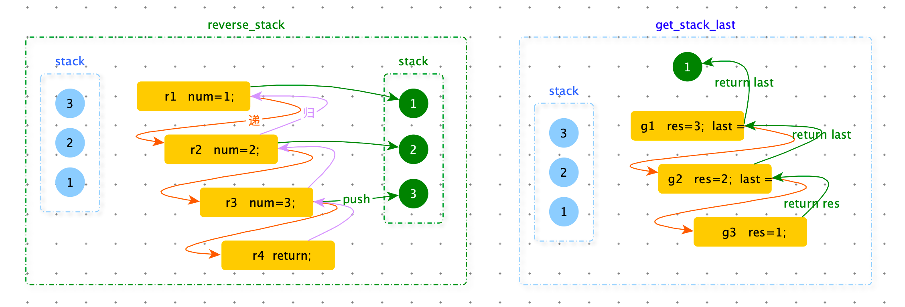

[TOC]

暴力递归就是尝试

1. 将问题转化为规模缩小的同类问题的子问题。
2. 有明确的不需要继续进行递归的条件（base case）
3. 获取子问题的结果之后，进行决策
4. 不记录每个子问题的解


暴力递归尝模型：

https://blog.csdn.net/weixin_46838716/article/details/124744732


```python
def hanoi(n):
    if n <= 0: return
    func(n, "左", "右", "中")

def func(i, start, end, other):
    if i == 1:
        print("Move 1 from " + start + " to " + end)
        return
    func(i - 1, start, other, end)
    print("Move " + str(i) + " from" + start + " to " + end)
    func(i - 1, other, end, start)

hanoi(3)
```


> 打印一个字符串的全部子序列，包括空字符串


```python
def print_all_sub_squences(string):
    process([], string, 0)

def process(char_array, string, i):
    if i == len(string):
        print(''.join(char_array))
        return
		
    # 不要 string[i]
    process(char_array, string, i + 1)
    # 拷贝数组
    char_array=char_array[:]
    # 要 string[i]
    char_array.append(string[i])
    process(char_array, string, i + 1)

print_all_sub_squences("abc")
```


```python
def print_all_sub_squences2(string):
    process2([s for s in string], 0)

def process2(char_array, i):
    if i == len(char_array):
        print(''.join(char_array))
        return

    # 要 char_array[i]
    process2(char_array, i + 1)

    # 不要 char_array[i]
    tmp = char_array[i]
    char_array[i] = ''
    process2(char_array, i + 1)
    # 还原 char_array
    char_array[i] = tmp
    
print_all_sub_squences2("abc")
```


在递归调用过程中，变化的参数越少越好。因为在暴力递归改动态规划时，动态变化的参数是需要用表存储的。


> 打印一个字符串的全排列


```python
# str[ i... ] 范围上，所有的字符，都可以在 i 位置上，后续都去尝试
# str[ 0...i-1 ] 范围上，是之前做的选择
# 请把所有的字符串形成的全排列，加入到 res 里去

def print_all(string):
    if not string: return
    char_array = [s for s in string]
    res = []
    process3(char_array, 0, res)
    return res

def process3(char_array, i, res):
    if i == len(char_array):
        res.append(''.join(char_array))
        return

    for j in range(i, len(char_array)):
        char_array[i], char_array[j] = char_array[j], char_array[i]
        process3(char_array, i + 1, res)
        char_array[i], char_array[j] = char_array[j], char_array[i]

print(print_all("abc"))
# ['abc', 'acb', 'bac', 'bca', 'cba', 'cab']
```


> 打印一个字符串的全部排列，要求不能出现重复的排列。

res 改为 set 去重

```python
def print_all(string):
    if not string: return
    char_array = [s for s in string]
    res = set()
    process3(char_array, 0, res)
    return res

def process3(char_array, i, res):
    if i == len(char_array):
        res.add(''.join(char_array))
        return

    for j in range(i, len(char_array)):
        char_array[i], char_array[j] = char_array[j], char_array[i]
        process3(char_array, i + 1, res)
        char_array[i], char_array[j] = char_array[j], char_array[i]

print(print_all("aabc"))
```


优化

```python
def print_all2(string):
    if not string: return
    char_array = [s for s in string]
    res = []
    process4(char_array, 0, res)
    return res


def process4(char_array, i, res):
    if i == len(char_array):
        res.append(''.join(char_array))
        return

    # 字符串只有小写字母：也可以替换成 set
    seen = [False] * 26
    for j in range(i, len(char_array)):
        index = ord(char_array[j]) - ord("a")
        if not seen[index]:
            seen[index] = True
            char_array[i], char_array[j] = char_array[j], char_array[i]
            process4(char_array, i + 1, res)
            char_array[i], char_array[j] = char_array[j], char_array[i]

print(print_all2("aabc"))
```


> 给定一个整型数组 arr，代表数值不同的纸牌排成一条线。玩家 A 和 玩家 B 依次拿走每张纸牌，规定玩家 A 先拿，玩家 B 后拿，但是每个玩家每次只能拿走最左或最右的纸牌，玩家 A 和 玩家 B 都绝顶聪明。请返回最后获胜者的分数。
>
> 【举例】arr = 【1	2	100	4】开始时，玩家 A  只能拿走 1 或 4 。如果开始时玩家 A 只能拿走 1，则排列变为【2	100	4】，接下来玩家 B 可以拿走 2 或 4，然后继续轮到玩家 A...
>
> 如果开始时玩家 A 拿走 4，则排列变为【1	2	100】，接下来玩家 B 可以拿走 1 或 100，然后继续轮到玩家 A...
>
> 玩家 A 作为绝顶聪明的人不会先拿走 4，因为拿走 4 之后，玩家 B 将拿走 100。所以玩家 A 会先拿 1，让排列变为【2	100	4】，接下来玩家 B 不管怎么选，100 都会被玩家 A 拿走。玩家 A 会获胜，分数为 101。所以返回 101
>
> arr =【1	100	2】 开始时，玩家 A 不管拿 1 还是 2，玩家 B 作为绝顶聪明的人，都会把 100 拿走。玩家 B 会获胜，分数100。所以返回 100。


```python
def win(nums):
    if not nums: return 0

    return max(frist(nums, 0, len(nums) - 1), second(nums, 0, len(nums) - 1))

# 先手函数，在 left 到 right 范围上尝试
def frist(nums, left, right):
    if left == right:
        return nums[left]
    # 本次先手：如果拿到 nums[left] 利益后，就变成在 left + 1 到 right 上的后手：second(nums, left + 1, right)
    # 本次先手：如果拿到 nums[right] 利益后，就变成在 left 到 right - 1 上的后手：second(nums, left, right - 1)
    return max(nums[left] + second(nums, left + 1, right), nums[right] + second(nums, left, right - 1))

# 后手函数
# 
def second(nums, left, right):
  # 如果只有一个数，这个数肯定被先手拿到，因此后手只能拿到 0
    if left == right:
        return 0
		# 先手可能是 frist(nums, left + 1, right) 或者 frist(nums, left, right - 1)
    # 先手从这两种决策中拿去最大值，后手只能拿去最小值
    return min(frist(nums, left + 1, right), frist(nums, left, right - 1))

print(win([1, 2, 100, 4]))
```


> 给你一个栈，请你逆序这个栈，不能申请额外的数据结构，只能使用递归函数。

下图是递归过程：




```python
def reverse_stack(stack):
    if not stack:
        return
    num = get_stack_last(stack)
    reverse_stack(stack)
    stack.append(num)

# 获取 stack 最底层的数据
def get_stack_last(stack):
    res = stack.pop()
    if not stack:
        return res
    last = get_stack_last(stack)
    stack.append(res)
    return last
  
stack = [1, 2, 3]
reverse_stack(stack)
```


> 规定 1 和 A 对应、2 和 B 对应、3 和 C 对应...
>
> 那么一个数字字符串比如“111”，就可以转化为 “AAA”、“KA” 和 “AK”
>
> 给定一个只有数字字符串组成的字符串 str，返回有多少种转化结果。


> 给定两个长度都为 N 的数组 weights 和 values，weights[i] 和 values[i] 分表代表 i 号物品的重量和价值。给定一个正数 bag，表示一个载重 bag 的背包          的物品不能超过这个重量。返回你能转下最多的价值是多少？

