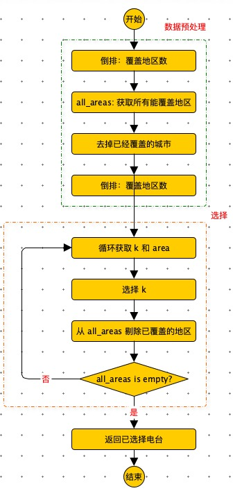

# 介绍

贪心算法：在求解时，每一步选择都采取当前最优的选择，从而希望得到全局最优解。

贪心算法求解的结果：不一定是全局最优解。

技巧

- <font color=green>贪心算法根据业务使用一种策略，在每一步获取当前最优解时，大概率会用堆，以 O(1) 的时间获取当前最小或者最大的数据，并且后续的步骤，可能会调整堆中数据。</font>
- <font color=orange>贪心策略一般决策时需要获取最小值或者最大值，如果贪心策略在决策后，不影响依赖数据的顺序，那么可以将数组排好序后，再进行贪心策略决策。</font>


# 应用

## 集合覆盖问题

如何选择最少的广播台，让所有的地区都可以接受信号。

| 广播台 | 覆盖地区         |
| ------ | ---------------- |
| K1     | 北京，上海，天津 |
| K2     | 广州，北京，深圳 |
| K3     | 成都，上海，杭州 |
| K4     | 上海，天津       |
| K5     | 杭州，大连       |

**策略：每次选择覆盖最多的广播台。**

```python
def get_max(data):
    # 根据覆盖地区数倒排
    data = sorted(data, key=lambda x: len(x[1]), reverse=True)
    # 能覆盖的所有地区
    all_areas = set()

    for i in range(len(data)):
        k, areas = data[i]
        # 过滤掉已经覆盖的城市
        data[i] = (k, set([city for city in areas if city not in all_areas]))
        all_areas = all_areas.union(areas)

    result = set()
    # 过滤后，重新排序
    data = sorted(data, key=lambda x: len(x[1]), reverse=True)
    print(data)
    for k, areas in data:
        result.add(k)
        all_areas = all_areas - areas
        if not all_areas: break
    return result

data = [("K1", ["北京", "上海", "天津"]), ("K2", ["广州", "北京", "深圳"]), ("K3", ["成都", "上海", "杭州"]), ("K4", ["上海", "天津"]),
        ("K5", ["杭州", "大连"])]
print(get_max(data))
# {'K1', 'K2', 'K5', 'K3'}
```





