[TOC]

# K 线基础知识

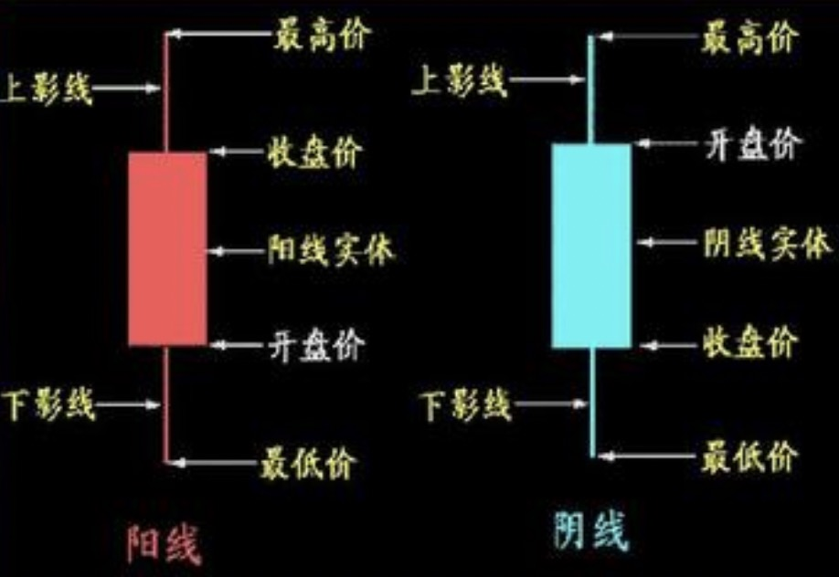

K 线包括四个价格因素：

1. 开盘价
2. 收盘价
3. 最高价
4. 最低价

阳线：开盘价 > 收盘价（未来趋势：看涨）

阴线：收盘价 > 开盘价（未来趋势：看跌）

上影线：主体到最高价之间线。（上涨最大幅度）

下影线：主体到最低价之间线。（下跌最大幅度）

不同周期时间：

1. 日 K 线：当前天的开盘价，收盘价，最高价，最低价。
2. 周 K 线：第一个交易日的开盘价，最后一个交易日的收盘价，中间的最高价和最低价。
3. 月 K 线：亦然。

注意：**阴线不代表亏钱，阳线不代表今天赚钱。因为存在高开，低开。**

K 线常见形态。

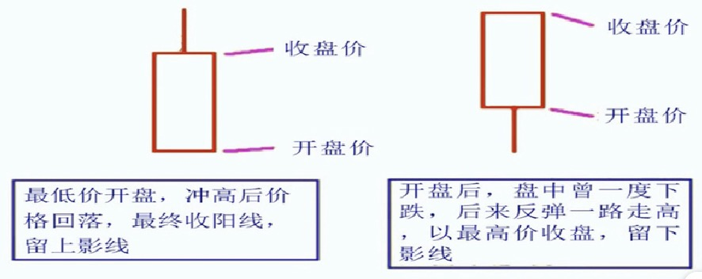

**最低价开盘**，冲高后回落，最终收阳线。多头战胜空头。

图二：**以最高加收盘**。

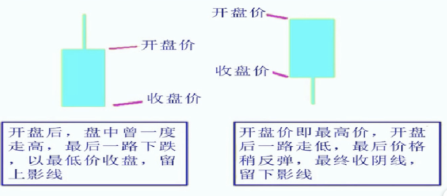

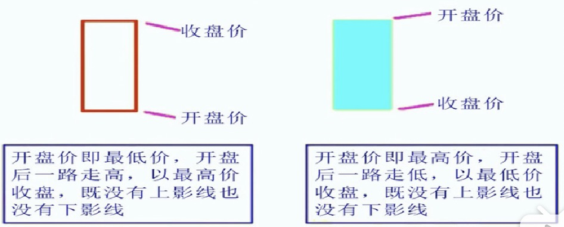

上涨强劲

下跌强劲

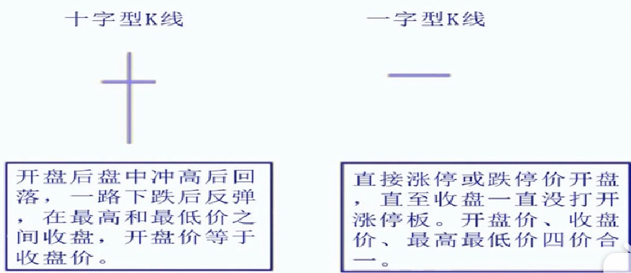

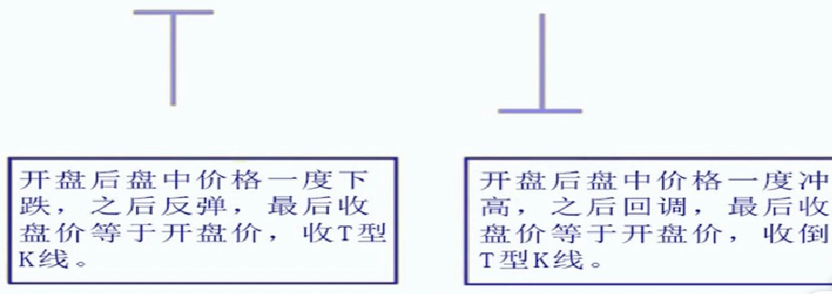

# K 线组合

# 移动平均线（MA）

移动平均线：把一段连续时间的收盘加算术平均，得出的一根平滑曲线。

**金叉**：当短周期的均线上穿长周期的均线，形成一个向上的交叉，通常看作**==上涨信号==**。

**死叉**：当短周期的均线下穿长周期的均线，形成一个向下的交叉，通常看作**==下跌信号==**。

多头排列：当短周期的均线在长周期的均线上方运行，**==代表强势行情，趋势看涨==**。

空头排列：当短周期的均线在长周期的均线下方运行，**==代表弱势行情，趋势看跌==**

参考**短周期的均线：把握操作时机**。

参考**长周期的均线：分析行情的整体趋势**。

只参与均线多头排列行情，绝不参与线空头排列行情。

只看一条均线进行决策：

图是30日均线。

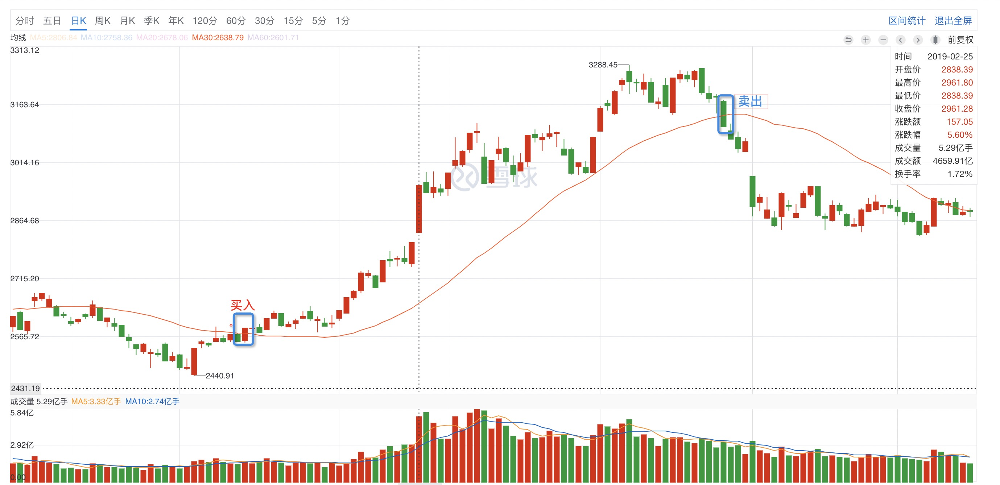

股价在均线上方：选择持有。

股价在均线下方：选择卖出。

两条均线进行决策：

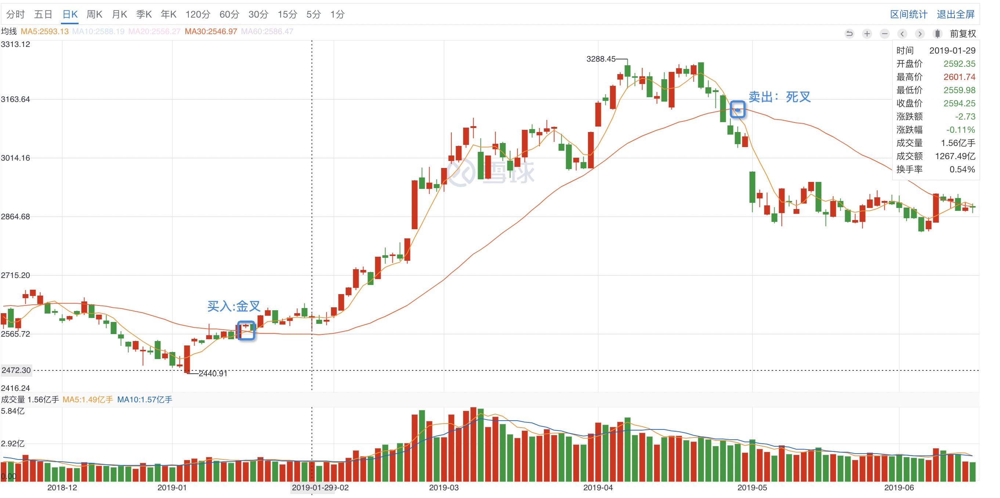

五日均线和30日均线。

五日均线在30日均线上方时，持有。

五日均线在30日均线下方时，卖出。

三条均线进行决策：

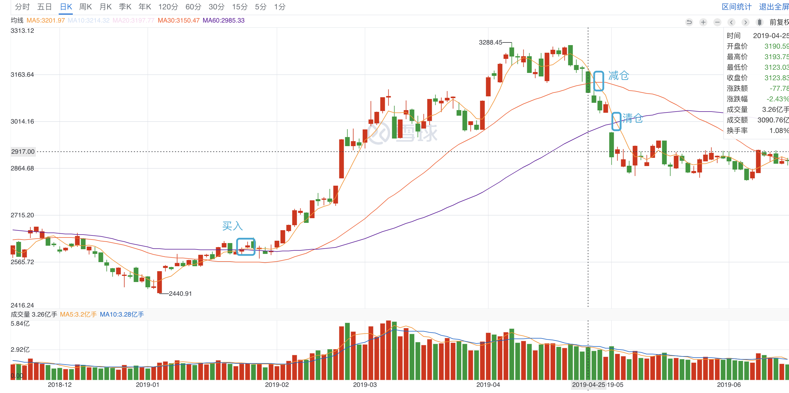

五日均线，30日均线，60日均线。

当五日均线在60日均线上时，持仓。

五日均线在30日均线下方时，减仓。

五日均线和30日均线在60日均线下方时，清仓。

通过60日曲线看大趋势。

# 成交量

多头量能：买入看涨的力量。

空头量能：卖出看涨的力量。

买多量能大，要买股票的多，股价可能上升。

空头量能大，卖出看涨的多，股价可能下降。

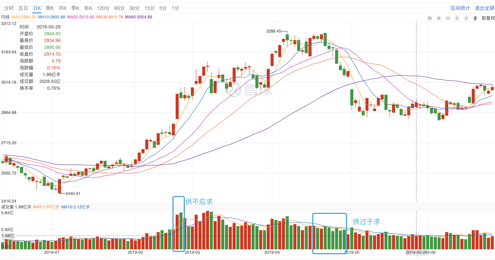

从2019-02 底，放量上涨。说明这段时间看涨买入的资金越来越活跃，价格比较好，卖出的比较少，出现了供不应求的现象，价格进一步上涨。

# 看盘

看大盘：

大盘上涨表示：95% 个股上涨。

大盘下跌表示：95% 个股下跌。

1. 看大盘处于多头排列期，还是空头排列期。
2. 看板块排名，哪个板块表现最强。看看资金在哪个板块炒作。如果自己加仓热门板块，更容易获利（短线操作）
3. 市场中个股涨跌的比例：如果股市上涨，但是大部分股票下跌，个别权重股上涨，带动的，虚涨，同理也有虚跌。
   1. **大盘涨**：同时大部分比例股票上涨，真上涨。
   2. **大盘跌**：同时大部分比例股票下跌，真下跌。
4. 看周边市场，港股指数，美股指数

# 趋势

1. 上涨趋势：不断抬高的波峰和波谷形成
2. 横盘趋势
3. 下跌趋势：不断降低的波峰和波谷形成

趋势：连续不断抬高或者降低的波峰和波谷组成。

趋势级别：

- 主要趋势
- 次要趋势
- 短暂趋势

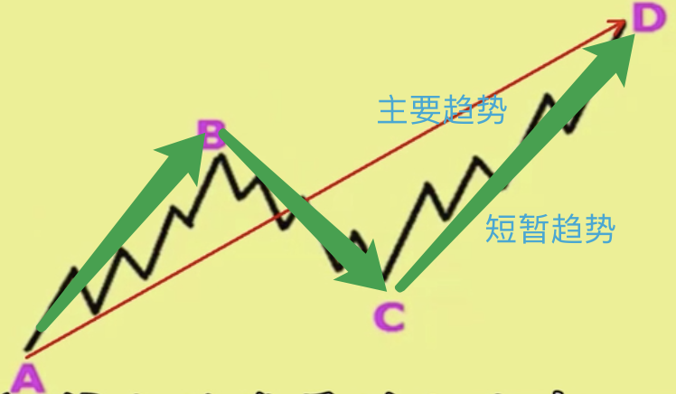

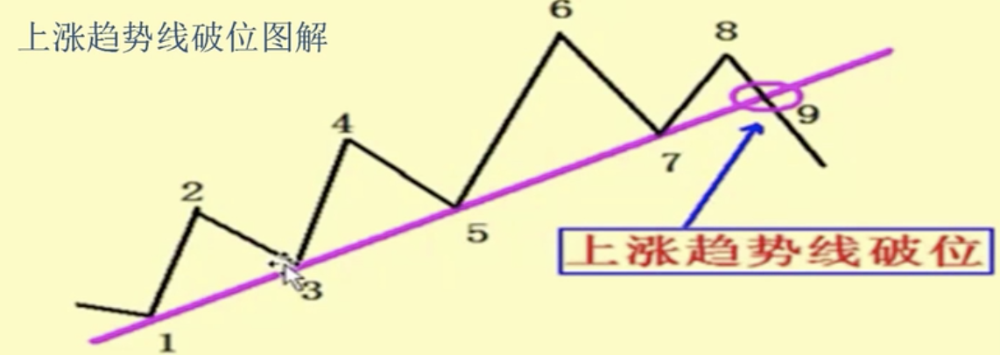

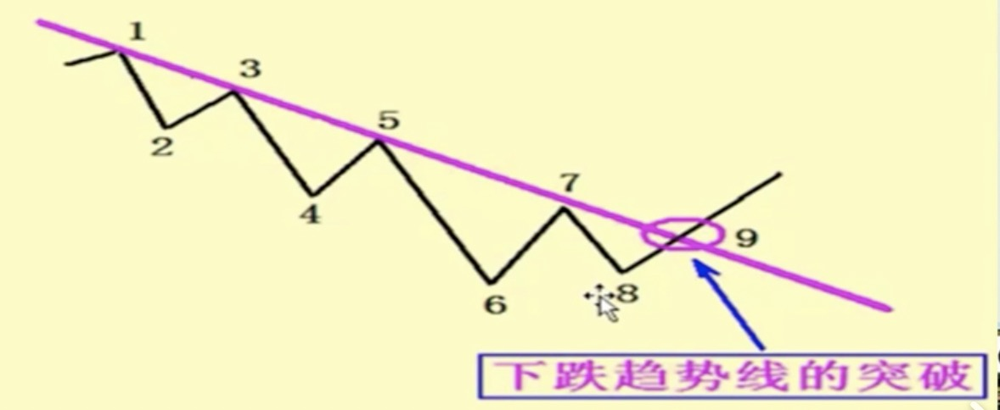

出破点：最好有量能的支持。量价齐升。这是一个买入点。

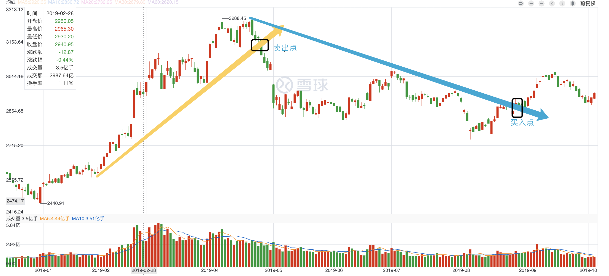

买入点：参考量。

