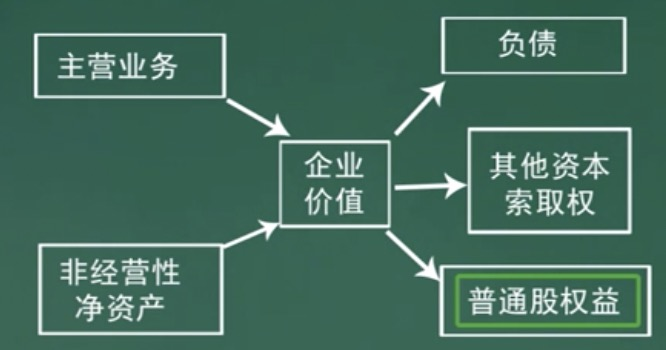
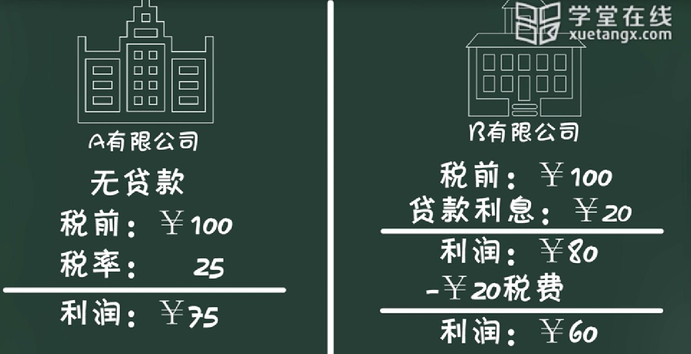

[TOC]

# 概念

PE：市盈率

PB：市净率

ROE：净资产收益率

企业价值与企业估值关系：

左边体现企业价值。

右边是企业价值的分配

普通股权益：就是我们最关系的估值。

估值的两类思路：

- 贴现现金流方法。

  - 通过企业创造的（或者股东能够获得的）未来收益进行估值（求和）。

- 乘数法。

  - 通过与其他同类型企业的比较进行估值。

  比如：

  爱奇艺每年每股利润 1 元，

  优酷每年每股利润 0.5 元。

  如果爱奇艺的股价是100元，那么优酷的股价就应该是 50 元。

# 贴现现金流方法

## 贴现的概念

资金的时间价值

​	今天的一元钱 != 明天的一元钱

​	因为今天的一元钱，可以用于投资，那么 今天一元钱 + 投资收益 == 明天的一元钱。

​	所以不同时间获得的钱不能简单相加，需要将未来的钱，折算成现在的钱。

贴现：将未来的钱，折算成现在的钱。

例子：现在有100 元进行投资，一年可以产生 10% 的收益，那么一年后就是 110 元，那么在真实的价值上一年后的110 元，相当于现在的100元。

$100*(1+10\%)=110$ 

计算一年后 110 元的现值：$\frac{110}{(1+10\%)}=100$ 

10% 就是贴现率。

上边是一年，那么 n 年：

二年后：$100*(1+10\%)^2$

三年后：$100*(1+10\%)^3$

...

n 年后最后一天，x 这么多钱的现值：$\frac{x}{(1+r)^n}$ 

r：贴现率。

## 永续年金贴现

企业价值：从现在开始，将未来到无穷远的所有收益求和。

假设一：企业每年收益 E，并且收益都是每年最后一天取得。

企业价值 = $E+\frac{E}{(1+r)}+\frac{E}{(1+r)^2}+\frac{E}{(1+r)^3}+...+\frac{E}{(1+r)^n}=\frac{E}{r}$

r：贴现率。

假设二：企业每年收益增长 g%

第一年收益为：$E * (1+g)$

第二年收益为：$E * (1+g)^2$

第三年收益为：$E * (1+g)^3$

...

第一年收益贴现为：$\frac{E * (1+g)}{(1+r)}$

第二年收益贴现为：$\frac{E * (1+g)^2}{(1+r)^2}$

第三年收益贴现为：$\frac{E * (1+g)^3}{(1+r)^3}$

...

企业价值 = $E+\frac{E * (1+g)}{(1+r)}+\frac{E * (1+g)^2}{(1+r)^2}+\frac{E * (1+g)^3}{(1+r)^3}+...+\frac{E * (1+g)^n}{(1+r)^n}=\frac{E}{(r-g)}$

这种加和方式叫做：永续年金，每年收益相等，每年收益增长相等。

## 贴现率的确定

**贴现率就是：公司投资人角色的预期收益**

- 债权人：事先与公司约定好的利率。
- 股东：股东承担了机会成本，所以股东就要求回报 >= 机会成本。

机会成本：一笔钱同一时间投资了A 公司，就不能投资B，C，D... 公司了。在其他公司投资的收益，就是投资 A 的机会成本。

B，C，D公司是和 A 公司风险级别相当的公司(同一行业的公司)。所以股东要求的回报是行业平均盈利水平，这就是**==股东的预期收益==** 这也是**==公司用投资人的资本成本==**。

公司的资本成本计算：加权平均。

假如公司有 40%资金来自债权人，贷款利率是 6%；有 60%资金来自股东，假设行业平均盈利水平是 12%。

**==加权平均资本成本==** = 40%*6% + 60% * 12%

B 公司少交 5 元的税。

**==加权平均资本成本==** = 40%*6% *(1-所得税率) + 60% * 12%

估计公司的整体价值，用公司整体资本成本（加权平均资本成本）计算。

**==估计权益的贴现率，就给用权益的资本成本（股东的预期收益），用行业的平均盈利水平计算==**。

行业的平均盈利水平，通过上市公司获得（比真实值偏高，应为上市公司都是好公司）。

### 资本资产定价模型（CAPM）

计算权益贴现率（权益资本成本）的方法：

1. 行业的平均盈利水平
2. CAPM

CAPM 模型：

$E(R_E)=R_f+B*(R_M-R_f)$

$E(R_E)$：权益资本成本的期望值，也就是股东的预期收益水平。

$R_f$：无风险收益率，可以用短期国债的收益率。

$R_M$：股票市场收益率（指数的收益率）。

$(R_M-R_f)$：风险溢价：市场收益率 与 无风险收益率之间的差。作用：补偿股东额外承担的风险的。

$B$：反映某个公司与市场的相关性。

系统风险：即不能被多元化投资抵消的风险。

例子：

假设：$R_f$=4%：三个月国债的年收益率。

$B=1.5$：指数上涨1%，本只股票上涨 1.5%。每个公司B 值不一样，这个值一些机构可以查。

$R_M$=10%：指数一年收益 10%。

CAPM 权益资本成本：

$4\%+1.5*(10\%-4\%)=13\%$

CAPM 模型的含义：获取高收益的唯一途径就是承担高风险。只有系统风险是可以补偿的，个体风险是不给补偿的。 