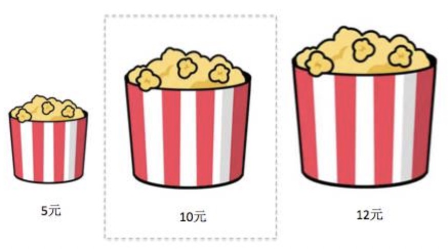

人在选择时，需要分析很多信息，非常耗费脑力。所以对于已有的经验，人类会形成条件反射，来减少判断成本。我们要了解，这种模式，加以利用，已达到事半功倍的效果。

**人在选择时，需要一个理由**：

1.  一分价钱一分货，好货不便宜。
2. 请别人帮忙时，给出一个原因。
3. 

所以：我们需要给用户一个合理理由，帮助他抉择。

**锚定效应：对人判断的影响**

也就**对比效应**

应用：给消费者定下一个诱饵，矬子里面选将军。

诱饵效应：人们在对某项东西选择举棋不定时，加入一个参考物，会使得原来那个更具有吸引力。

| 电子版        | 59美元  | 84%  |
| ------------- | ------- | ---- |
| 电子版+印刷版 | 125美元 | 16%  |

| 电子版        | 59美元  | 32%  |
| ------------- | ------- | ---- |
| 印刷版        | 125美元 | 0%   |
| 电子版+印刷版 | 125美元 | 60%  |

互惠

