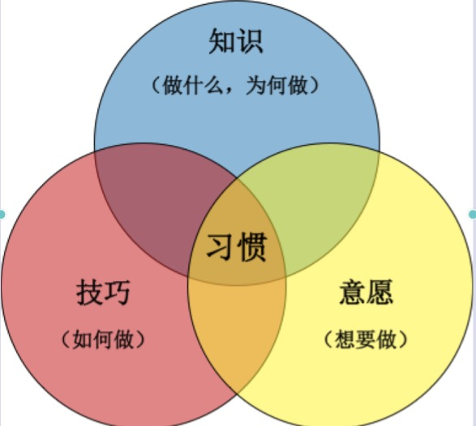
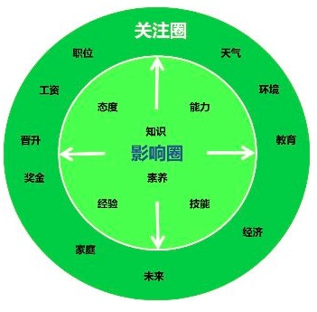
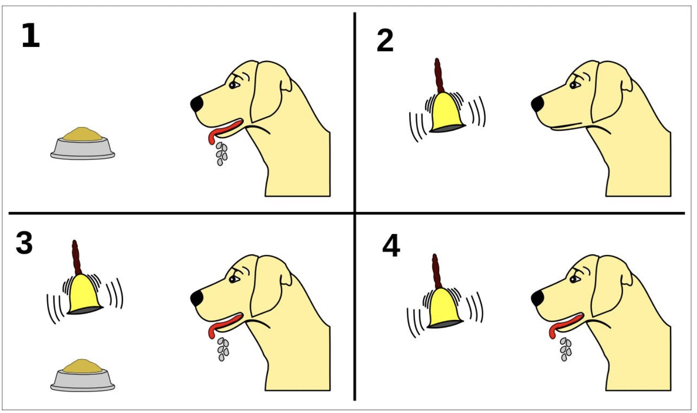
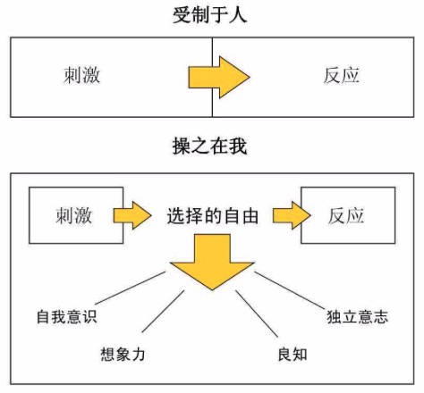
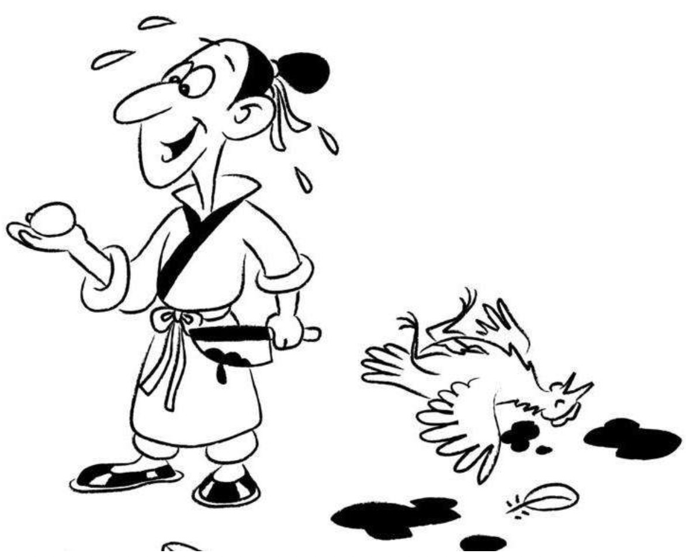
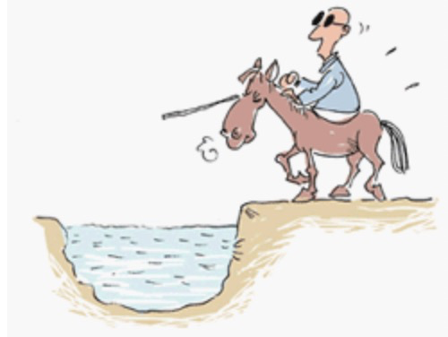
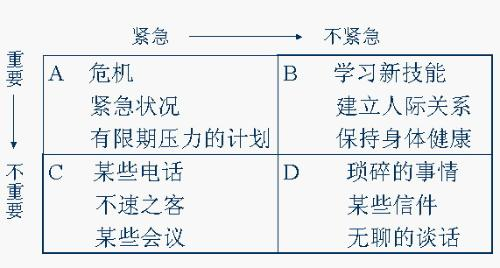

[TOC]

# 7 个习惯

1. 积极主动
2. 以终为始
3. 要事第一
4. 双赢思维
5. 知彼解己
6. 统合综效
7. 不断更新

# 格言

1. 变化的世界，不变的原则。

2. 人的行为总是已在重复，因此卓越不是单一的举动，而是习惯。

   一次成功不重要，重要的是习惯成功。

3. 和内在力量相比，身外之物显得微不足道。

4. 当想清结局，对策自然明了。

5. 我们不可能打破法则，只能在违背原则时，让自己头破血流。

# 习惯概论

习惯有极大的引力。

# 积极主动

## 影响圈与关注圈

### 理论

积极主动的人专注于：影响圈。

面对的问题：

1. 直接控制：（对自己）通过培养习惯解决。
2. 间接控制：（对别人）施加措施影响对方。
3. 无法控制（无能为力）：微笑，真诚与平和地接受现实。

### 抓手

影响圈的核心：==做出承诺与信守诺言==。

直接掌控人生的途径：

1. 做出承诺与信守诺言。
2. 确立目标，付诸行动。

## 刺激反应模型

巴甫洛夫的狗。

积极主动：不仅是行事态度上，还意味着对自己人生负责。

除非拱手向让，否则没有人能剥夺我们的自尊。

我昨日的选择，决定了今日的我。

选择自由：必将带来错误的选择，

止损，这是责任感的表现，承认错误，承担苦果，总结经验，为后续行动新增助力。

被毒蛇咬了，一心忙着追赶毒蛇，只会令毒发作的更快，不如设法尽快排毒。

直接掌控人生的途径：

1. 做出承若，并信守承若。
2. 确立目标，并付诸实践。

培养了：诚信，自制力，勇气，担当责任等。

在人际交往过程中：每个人都是狗。要有良好的关系，可以有意识地，训练伙伴。

## 效能

产出与产能的平衡。

# 以终为始

做==**任何事**==之前，先认清==**方向**==。

==**任何事情**==都是两次创造而成：

1. 头脑中构思：智力。
2. 付诸实践：体力。

生活中，如果自己不积极主动进行设计（第一次创造），那么就会被动接受别人的设计。

以原则为中心。

# 要事第一

==**最重要事情的最大敌人是：次重要事情。**==

将军赶路，不追小兔。

在你目前的生活中，有哪些事情能够彻底改观你的个人生活，但是你一直没有去做？

在你目前的生活中，有哪些事情能够彻底改观你的工作，但是你一直没有去做？

**时间管理**

着重处理B，尽量减少A。

重要性与目标有关，凡是有价值、有利于实现个人目标的就是要事。

